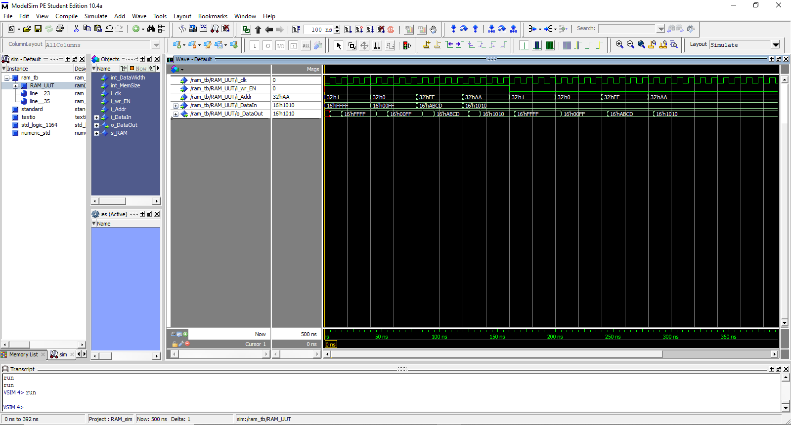

<h1> VHDL Examples </h1>

<h3>Why This Repo?</h3>

 This repo basically aims to help you with your very first VHDL codes and digital designs. There are also many sources on internet, especially for spesific projects such as VGA drive, 7 segment displays and even for RISC based microcontroller/processor architectures. 

<h3> Which Programs Are Used? </h3>

 As text editor Visual Studio Code and for simulations ModelSim are used in this repo. Please check the links below to see how to download Visual Studio Code and Modelsim. 

<ul>
    <li> <a href="https://www.youtube.com/watch?v=1AnXVuSm90c&t=15s" target="_blank">ModelSim Download Tutorial on YouTube</a> </li>
    <li> <a href="https://www.youtube.com/watch?v=9mpRF6bAY1g" target="_blank">ModelSim Tutorial on YouTube</a> </li>
    <li> <a href="https://code.visualstudio.com/download" target="_blank">Visual Studio code Download Link</a> </li>
</ul>

 Note #1: If you already have any IDE or programs to run your code, these installations are not important. You can also try these codes on your IDE. 

 Note #2: Also "Modern VHDL" extension pack is used for writing VHDL code easier. After installation, you also can download and install by searching it in extension packs tab in VSCode. 

 Note #3: For MAC users also there are GHDL and GTKWave programs.

<h2> How To?</h2>

 Basically, you can open files with ".mpf" extensions on ModelSim and compile the code. Testbenches are named as "_CodeName_tb.vhd". Start simulation on a testbench, add your waves to simulation and run within dedicated time on the tab on top of the program. A simulation of RAM code is shown below: 

